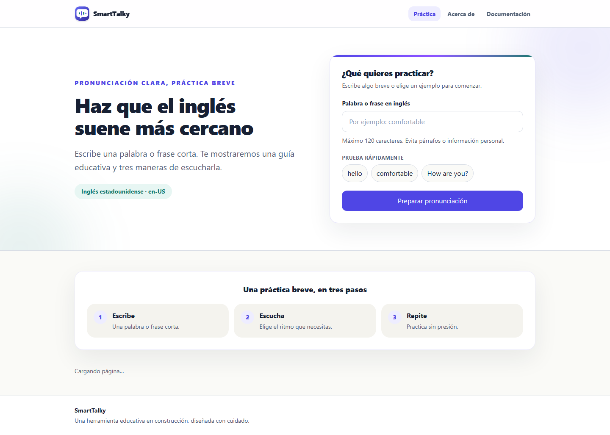
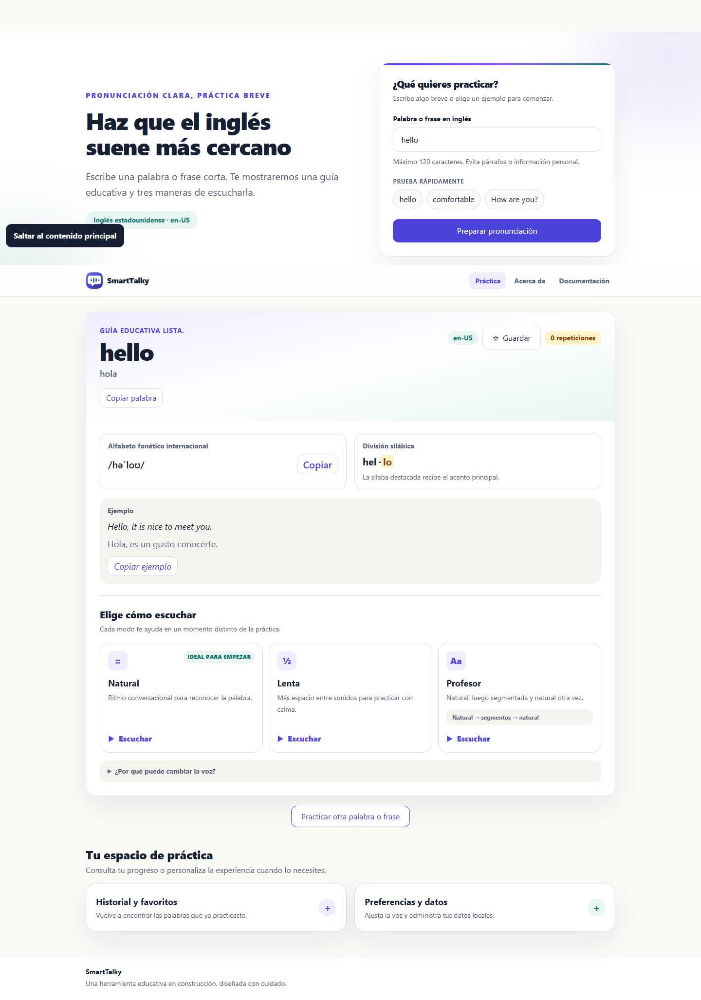
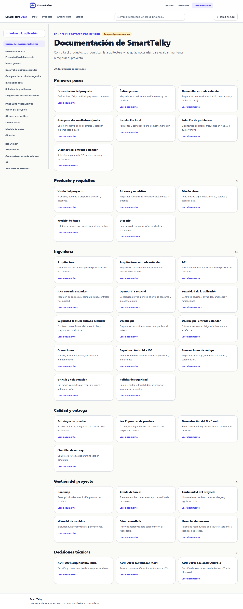

# Demostración del MVP web

## Objetivo

Presentar SmartTalky de forma reproducible, sin cuenta, secretos ni consumo pagado. El recorrido predeterminado usa la API simulada y Web Speech como voz audible cuando el navegador lo permite.

## Verificación automática

Desde la raíz, ejecute:

```bash
npm run demo:check
```

El script abre la API en un puerto efímero y comprueba salud, guía determinista para `comfortable`, tres modalidades y entrega de un WAV simulado de 44 bytes. Cierra el puerto siempre. No lee `.env`, no usa `OPENAI_API_KEY`, no llama OpenAI y no conserva archivos.

## Evidencia visual real

Estas imágenes no son maquetas. Se capturan con Chromium sobre el build de
producción local y la API simulada:








Para regenerarlas:

```bash
npm run screenshots:capture
```

El comando recompila, inicia API y web en procesos aislados, toma las cuatro
capturas y cierra los servicios. La variable `OPENAI_API_KEY` se fuerza vacía.

## Iniciar la demostración

Use dos terminales desde la raíz:

```bash
npm run dev --workspace @smarttalky/api
```

```bash
npm run dev --workspace @smarttalky/web
```

La API usa `http://127.0.0.1:3000` y Vite informa la URL web. Si el puerto 3000 está ocupado, configure el mismo puerto alternativo en `PORT` para la API y `SMARTTALKY_API_TARGET` para la web.

## Guion de cinco minutos

1. Abra Práctica y escriba `comfortable`.
2. Señale IPA, sílaba tónica, traducción y ejemplo.
3. Reproduzca Natural: el WAV simulado activa la voz gratuita Web Speech y la UI identifica su origen.
4. Guarde la palabra; confirme historial y favorito.
5. Cambie velocidad y modalidad, recargue y muestre que persisten.
6. Exporte el JSON; no es necesario abrirlo durante la demo.
7. Abra Acerca de para explicar datos locales, backend/OpenAI opcional y límites de Web Speech.
8. Abra Documentación para demostrar trazabilidad, arquitectura y pruebas.

Alternativas deterministas: `hello` tiene guía completa; una frase como `How are you?` demuestra valores educativos opcionales no disponibles sin impedir audio.

## Recuperación preparada

- Si la API está detenida, la guía muestra un error y el mismo botón permite reintentar después de iniciarla.
- Si no existe Web Speech, la guía sigue visible y el reproductor muestra un error reintentable.
- Si el navegador bloquea almacenamiento o descargas, la sesión continúa en memoria y los datos no se borran.
- Nunca active la prueba TTS manual pagada durante esta demo.
